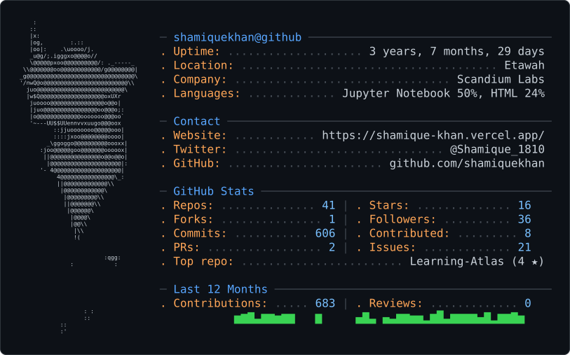

<!-- =========================================================
     SHAMIQUE KHAN — GITHUB PROFILE README
     Aesthetic: monochrome / terminal / signal red
     Accent: #D71921
     ========================================================= -->

<picture>
  <source media="(prefers-color-scheme: dark)" srcset="dark_mode.svg" />
  <source media="(prefers-color-scheme: light)" srcset="light_mode.svg" />
  
</picture>

<!-- =========================================================
     SYSTEM BOOT
     ========================================================= -->

  

  

  
  
  

> SYSTEM PROFILE

  

<table align="center">
  <tr>
    <td align="right"><strong>FOCUS</strong></td>
    <td>Agentic AI • LLM Systems • Scientific ML • Quantitative AI</td>
  </tr>
  <tr>
    <td align="right"><strong>BUILD_MODE</strong></td>
    <td>Architecture → Implementation → Evaluation → Deployment</td>
  </tr>
  <tr>
    <td align="right"><strong>RESEARCH</strong></td>
    <td>Mechanistic Interpretability • Physics-Informed ML • AI Systems</td>
  </tr>
  <tr>
    <td align="right"><strong>OPEN_SOURCE</strong></td>
    <td>Python tooling • ML infrastructure • reproducible experiments</td>
  </tr>
</table>

> TECHNICAL ARSENAL

  

> PROGRAMMING LANGUAGES

  
  
  
  
  
  
  

> AGENTIC AI / LLM SYSTEMS

  
  
  
  
  
  
  
  
  

> MACHINE LEARNING / SCIENTIFIC COMPUTING

  
  
  
  
  
  
  
  
  

> BACKEND / DATA / INFRASTRUCTURE

  
  
  
  
  
  
  
  
  

> GITHUB TELEMETRY

  

  <picture>
    <source
      media="(prefers-color-scheme: dark)"
      srcset="https://github-readme-stats.vercel.app/api?username=shamiquekhan&show_icons=true&hide_border=true&bg_color=0D1117&title_color=D71921&text_color=FFFFFF&icon_color=D71921&ring_color=D71921&include_all_commits=true"
    />
    <source
      media="(prefers-color-scheme: light)"
      srcset="https://github-readme-stats.vercel.app/api?username=shamiquekhan&show_icons=true&hide_border=true&bg_color=FFFFFF&title_color=D71921&text_color=1B1B1D&icon_color=D71921&ring_color=D71921&include_all_commits=true"
    />
    
  </picture>

  <picture>
    <source
      media="(prefers-color-scheme: dark)"
      srcset="https://github-readme-stats.vercel.app/api/top-langs/?username=shamiquekhan&layout=compact&hide_border=true&bg_color=0D1117&title_color=D71921&text_color=FFFFFF&langs_count=8&size_weight=0.5&count_weight=0.5"
    />
    <source
      media="(prefers-color-scheme: light)"
      srcset="https://github-readme-stats.vercel.app/api/top-langs/?username=shamiquekhan&layout=compact&hide_border=true&bg_color=FFFFFF&title_color=D71921&text_color=1B1B1D&langs_count=8&size_weight=0.5&count_weight=0.5"
    />
    
  </picture>

  

  

> GITHUB HIGHLIGHTS

  

<table align="center">
  <tr>
    <td align="center" valign="middle">
      <a href="https://github.com/shamiquekhan/ai-investment-advisor-agent">
        <strong>AI Investment Advisor Agent</strong>
      </a> 
      
      
      
    </td>
    <td align="center" valign="middle">
      <a href="https://github.com/shamiquekhan/Tensorflow_rag_Q-A_application">
        <strong>TensorFlow RAG Q&amp;A</strong>
      </a> 
      
      
      
    </td>
  </tr>
  <tr>
    <td align="center" valign="middle">
      <a href="https://github.com/shamiquekhan/SK-AutoD-ML-Library-for-Training-Curve-Auto-Diagnostician">
        <strong>SK-AutoD</strong>
      </a> 
      
      
      
    </td>
    <td align="center" valign="middle">
      <a href="https://github.com/shamiquekhan/GreenMagic">
        <strong>GreenMagic</strong>
      </a> 
      
      
      
    </td>
  </tr>
  <tr>
    <td align="center" valign="middle">
      <a href="https://github.com/shamiquekhan/neuromorphic-sleep-staging-pipeline">
        <strong>Neuromorphic Sleep Staging</strong>
      </a> 
      
      
      
    </td>
    <td align="center" valign="middle">
      <a href="https://github.com/shamiquekhan/AI-guest-messaging-automation-system">
        <strong>AI Guest Messaging Automation</strong>
      </a> 
      
      
      
    </td>
  </tr>
</table>

  

> CONTRIBUTION MATRIX

  

  

> OPEN_SOURCE SIGNALS

  

  

  

  Open-source activity and repository metrics are intentionally kept dynamic.

> SIGNAL UPLINK

  

  
  
  

  

  © Shamique Khan • AI / ML • Research • Open Source

